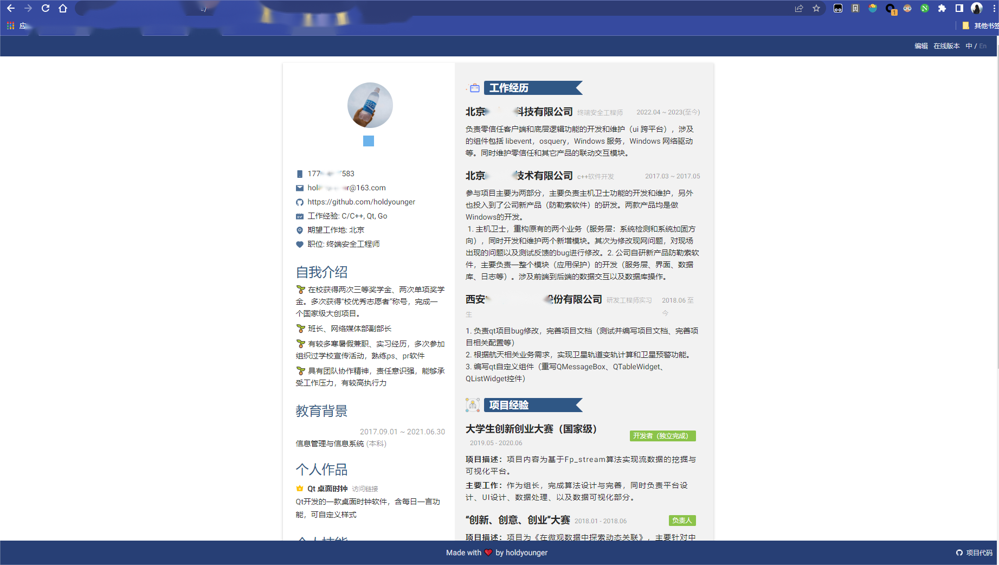
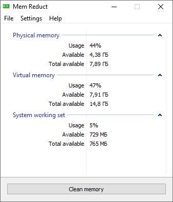

<h1 align="center">Welcome to 学习笔记 👋</h1>

  

> 写在最前，本文是个人学习过程中整理的文档概要，涉及但不限于 Qt|C++|Linux|Windows 等方向。另外整理了看到的一些开源项目，供参考和学习。

## Author

👤 **mingming**

* Website: holdyounger.github.io
* Github: [@holdyounger](https://github.com/holdyounger)

本文转自 [🏠 Wiki](holdyounger.github.io),可直接访问 [🏠 Wiki](holdyounger.github.io)

[toc]

# 开源项目推荐

## 1. [visiky/resume: 🚀 在线简历生成器](https://github.com/visiky/resume)

> :star: Starred 2k
>
> [visiky/resume: 🚀 在线简历生成器](https://github.com/visiky/resume)

1. 可通过json直接生成一份个人建立，方便维护的查阅。
2. 有多种模板可供选择，自定义主题色
3. 支持中英文版本
4. 可在线编辑

如下所示为我参考 [visiky](https://github.com/visiky)实现的个人简历。

## 2. [henrypp/memreduct](https://github.com/henrypp/memreduct)

> :star: Starred 2.9k
>
> Lightweight real-time memory management application to monitor and clean system memory on your computer
>
> Windows 系统内存清理软件。其代码书写和设计以及功能实现很适合windows开发同学参考学习。

# 🚅 参赛经历

## 声网前端

1. [音频房间创建及连接说明](https://github.com/holdyounger/ScopeBlog/issues/126)
2. [声网参赛经历记录——白板插件开发(前端)](https://github.com/holdyounger/ScopeBlog/issues/139)

# 📚 阅读记录

## 《计算机网络》

1. [第7章 网络安全](https://github.com/holdyounger/ScopeBlog/issues/112)

## 《深入理解Windows操作系统》

1. [OSI参考模型](https://github.com/holdyounger/ScopeBlog/issues/80)
1. [热补丁支持](https://github.com/holdyounger/ScopeBlog/issues/113)

## 《C++Primer Plus》

1. [C++ 枚举](https://github.com/holdyounger/ScopeBlog/issues/78)
1. [友元](https://github.com/holdyounger/ScopeBlog/issues/90)

## 《Effective C++》

1. [&lt;2&gt; const 关键字](https://github.com/holdyounger/ScopeBlog/issues/84)
2. [&lt;3&gt; 确定对象使用前初始化](https://github.com/holdyounger/ScopeBlog/issues/83)
3. [&lt;4&gt; 了解C++默认创建并调用的函数](https://github.com/holdyounger/ScopeBlog/issues/81)

## 《Windows 核心编程》

1. [返回值类型的规范](https://github.com/holdyounger/ScopeBlog/issues/82)
2. 

# 🧶 Qt

## 经验整理

1. [Qt常用基础代码汇总](https://github.com/holdyounger/ScopeBlog/issues/110)
2. [【一文搞懂】qss](https://github.com/holdyounger/ScopeBlog/issues/119)
3. [【一文搞懂】Qt 国际化](https://github.com/holdyounger/ScopeBlog/issues/39)

## Qt动画

1. [Qt动画类](https://github.com/holdyounger/ScopeBlog/issues/124)
2. [Qt任务栏显示进度条](https://github.com/holdyounger/ScopeBlog/issues/71)
1. [QStackWidget动画（1）](https://github.com/holdyounger/ScopeBlog/issues/70)
2. [Qt 启动动画](https://github.com/holdyounger/ScopeBlog/issues/69)
3. [Qt 动画效果 （抖动、下坠、透明度）](https://github.com/holdyounger/ScopeBlog/issues/68)
4. [QStackWidget动画2](https://github.com/holdyounger/ScopeBlog/issues/73)
5. [Qt 圆形进度条](https://github.com/holdyounger/ScopeBlog/issues/125)

## QHttp

1. [Qt Http 下载（转载）](https://github.com/holdyounger/ScopeBlog/issues/142)

## ui及样式问题

1. [QAction Icon 大小问题](https://github.com/holdyounger/ScopeBlog/issues/28)
2. [Qt窗口适配系统缩放](https://github.com/holdyounger/ScopeBlog/issues/75)

## 气泡

1. [Qt 鼠标 hover 操作时弹出文字气泡](https://github.com/holdyounger/ScopeBlog/issues/143)
2. [Qt 自定义气泡](https://github.com/holdyounger/ScopeBlog/issues/120)
3. [Qt在Win系统上的消息通知](https://github.com/holdyounger/ScopeBlog/issues/121)
4. [窗体不显示或半透明](https://github.com/holdyounger/ScopeBlog/issues/117)
5. [Qt图片旋转](https://github.com/holdyounger/ScopeBlog/issues/42)

## 未分类

1. [png和jpg格式的图片(一)](https://github.com/holdyounger/ScopeBlog/issues/30)
2. [png和jpg格式的图片(二)](https://github.com/holdyounger/ScopeBlog/issues/141)
3. [Qt 重启](https://github.com/holdyounger/ScopeBlog/issues/140)
4. [Qt获取控件位置](https://github.com/holdyounger/ScopeBlog/issues/123)
5. [Qt 截图](https://github.com/holdyounger/ScopeBlog/issues/122)
6. [Qt插件——使用 QtCipherSqlitePlugin 对数据库进行加密](https://github.com/holdyounger/ScopeBlog/issues/127)
7. [QListWidget 用法整理](https://github.com/holdyounger/ScopeBlog/issues/116)
8. [使用 QWebEngineView 加载网页慢的问题](https://github.com/holdyounger/ScopeBlog/issues/118)
9. [QTableWidget 遍历](https://github.com/holdyounger/ScopeBlog/issues/77)
10. [QLineEdit 修改部分文本样式](https://github.com/holdyounger/ScopeBlog/issues/74)
11. [Qt因为槽函数问题或者逻辑问题导致重复new问题解决办法及建议](https://github.com/holdyounger/ScopeBlog/issues/72)
12. [Qt事件过滤器（eventFilter）](https://github.com/holdyounger/ScopeBlog/issues/43)
13. [Qt窗口居中显示](https://github.com/holdyounger/ScopeBlog/issues/41)
14. [Qt实现窗口拖拽](https://github.com/holdyounger/ScopeBlog/issues/40)

# 🌘 Code

## C++

### 经验

1. [C++ 常见错误——无法解析的外部符号](https://github.com/holdyounger/ScopeBlog/issues/135)
1. [C++常用写法整理](https://github.com/holdyounger/ScopeBlog/issues/92)

### C++开源库

#### libevent

1. [libevent http server](https://github.com/holdyounger/ScopeBlog/issues/129)
2. [libevent——evconnlistener_new_bind(1)](https://github.com/holdyounger/ScopeBlog/issues/52)

#### Json11

1. [Json11 C++ 用法总结](https://github.com/holdyounger/ScopeBlog/issues/17)

### 用法

1. [正则表达式反向引用](https://github.com/holdyounger/ScopeBlog/issues/37)
3. [函数声明](https://github.com/holdyounger/ScopeBlog/issues/86)
6. [字符串类型转换整理(char、TCHAR、string、wstring、CString、WCHAR)](https://github.com/holdyounger/ScopeBlog/issues/115)
7. [using 用法整理](https://github.com/holdyounger/ScopeBlog/issues/4)
8. [动态声明子类](https://github.com/holdyounger/ScopeBlog/issues/3)
9.  [各种宏定义用法整理](https://github.com/holdyounger/ScopeBlog/issues/2)
10. [try-catch块](https://github.com/holdyounger/ScopeBlog/issues/23)
11. [Lambda表达式](https://github.com/holdyounger/ScopeBlog/issues/22)
12. [using 用法整理](https://github.com/holdyounger/ScopeBlog/issues/21)
13. [动态声明子类](https://github.com/holdyounger/ScopeBlog/issues/20)
11. [各种宏定义用法整理](https://github.com/holdyounger/ScopeBlog/issues/19)
17. [⏰ 时间处理](https://github.com/holdyounger/ScopeBlog/issues/16)
18. [文件大小换算方法](https://github.com/holdyounger/ScopeBlog/issues/27)
19. [文件后缀校验](https://github.com/holdyounger/ScopeBlog/issues/18)

## Golang

### GoHack

1. [GO HACK PE文件分析](https://github.com/holdyounger/ScopeBlog/issues/26)

# 🛰 网络

1. [OSI参考模型](https://github.com/holdyounger/ScopeBlog/issues/80)
2. [OSI七层网络协议模型各层协议](https://github.com/holdyounger/ScopeBlog/issues/128)
3. [IPv6](https://github.com/holdyounger/ScopeBlog/issues/35)
4. 

## tcp

1. [tcp.flags 说明](https://github.com/holdyounger/ScopeBlog/issues/63)
1. [TCP/IP的四元组、五元组、七元组](https://github.com/holdyounger/ScopeBlog/issues/33)

## Curl

1. [Curl使用的一些demo，记录](https://github.com/holdyounger/ScopeBlog/issues/32)
2. [Curl 请求 Https](https://github.com/holdyounger/ScopeBlog/issues/50)

## Socket

1. [socket 长连接](https://github.com/holdyounger/ScopeBlog/issues/34)

#  Linux

1. [Linux RPC](https://github.com/holdyounger/ScopeBlog/issues/133)
2. [Linux查询是否安装了某个软件](https://github.com/holdyounger/ScopeBlog/issues/132)
3. [5 环境变量与文件查找](https://github.com/holdyounger/ScopeBlog/issues/131)
4. [Linux基础入门15 Linux进程概念](https://github.com/holdyounger/ScopeBlog/issues/130)
5. [Linux内核2 跟踪分析Linux内核的启动过程](https://github.com/holdyounger/ScopeBlog/issues/67)
6. [ls命令详解](https://github.com/holdyounger/ScopeBlog/issues/66)
7. [Linux 内核分析配套实验](https://github.com/holdyounger/ScopeBlog/issues/65)
8. [linux 内核1 完成一个简单的时间片轮转躲到程序内核代码](https://github.com/holdyounger/ScopeBlog/issues/64)
9. [切换shell](https://github.com/holdyounger/ScopeBlog/issues/36)

# :wrench: 工具

1. [Readme 工具使用手册](https://github.com/holdyounger/ScopeBlog/issues/111)
2. [自动生成 readme 文档](https://github.com/holdyounger/ScopeBlog/issues/138)

# :computer: Windows

## 虚拟网卡专栏

1. [监控指定网卡事件](https://github.com/holdyounger/ScopeBlog/issues/97)
2. [监控网卡事件](https://github.com/holdyounger/ScopeBlog/issues/94)
3. [网络连接事件](https://github.com/holdyounger/ScopeBlog/issues/109)
4. [监控路由事件](https://github.com/holdyounger/ScopeBlog/issues/108)
5. [监控系统事件（网卡）](https://github.com/holdyounger/ScopeBlog/issues/55)
6. [C++ 通过 COM 组件 启用&#92;禁用&#92;查看 网卡状态](https://github.com/holdyounger/ScopeBlog/issues/96)
7. [操作网卡类](https://github.com/holdyounger/ScopeBlog/issues/95)
8. [iphepler 接口整理](https://github.com/holdyounger/ScopeBlog/issues/99)

## 批处理

1. [cmd——route](https://github.com/holdyounger/ScopeBlog/issues/105)
2. [批处理获取ip到剪切板](https://github.com/holdyounger/ScopeBlog/issues/103)

## PowerShell

## 工具

1. [Procmon 过滤用法](https://github.com/holdyounger/ScopeBlog/issues/59)
2. 

## 内存泄漏

1. [使用 UMDH 定位用户模式内存泄漏](https://github.com/holdyounger/ScopeBlog/issues/100)
2. [【不敢说一文搞懂】VLD 内存泄漏定位](https://github.com/holdyounger/ScopeBlog/issues/137)
3. [内存泄漏分析实战](https://github.com/holdyounger/ScopeBlog/issues/91)

## 权限相关

1. [提权工具 psExec.exe](https://github.com/holdyounger/ScopeBlog/issues/104)
2. [Windows 降权](https://github.com/holdyounger/ScopeBlog/issues/101)
3. [提权](https://github.com/holdyounger/ScopeBlog/issues/98)
4. [服务中以管理员&#92;普通权限启动进程](https://github.com/holdyounger/ScopeBlog/issues/102)

## 驱动

1. [一个完整的wfp驱动](https://github.com/holdyounger/ScopeBlog/issues/107)
2. 

## IPC

1. [系统锁](https://github.com/holdyounger/ScopeBlog/issues/54)
2. [管道demo](https://github.com/holdyounger/ScopeBlog/issues/53)
3. [【管道】（二） 管道通信](https://github.com/holdyounger/ScopeBlog/issues/25)
4. [【管道】（一） 初识管道](https://github.com/holdyounger/ScopeBlog/issues/24)

## 未分类

1. [Win7 使用未签名驱动程序](https://github.com/holdyounger/ScopeBlog/issues/58)
2. [FormatMessage函数的使用](https://github.com/holdyounger/ScopeBlog/issues/57)
3. [Windows聚焦不更新](https://github.com/holdyounger/ScopeBlog/issues/56)
4. [winuser说明](https://github.com/holdyounger/ScopeBlog/issues/106)
6. [使用 winsock2 相关函数](https://github.com/holdyounger/ScopeBlog/issues/93)
7. [加载动态库 (loadlibrary)](https://github.com/holdyounger/ScopeBlog/issues/61)
8. [windows 查看进程启动参数命令行](https://github.com/holdyounger/ScopeBlog/issues/134)
9. [共享文件夹](https://github.com/holdyounger/ScopeBlog/issues/136)

# 其他

1. [密钥分配](https://github.com/holdyounger/ScopeBlog/issues/114)
2. [3-hexo 主题快捷键](https://github.com/holdyounger/ScopeBlog/issues/87)
3. [typora bluebook 自定义修改主题代码](https://github.com/holdyounger/ScopeBlog/issues/76)
4. [Xcode 下载与安装](https://github.com/holdyounger/ScopeBlog/issues/62)
5. [UnSplash 获取随机图片的API](https://github.com/holdyounger/ScopeBlog/issues/60)
6.  [切换shell](https://github.com/holdyounger/ScopeBlog/issues/36)
7.  [自然辩证法](https://github.com/holdyounger/ScopeBlog/issues/29)
8.  [visual studio 编译告警常见处理手段](https://github.com/holdyounger/ScopeBlog/issues/15)
9.  [TypeScript](https://github.com/holdyounger/ScopeBlog/issues/14)
10. [中国马克思主义科学技术观](https://github.com/holdyounger/ScopeBlog/issues/13)

# 手册

1. [代码规范](https://github.com/holdyounger/ScopeBlog/issues/11)
2. [git emoji手册](https://github.com/holdyounger/ScopeBlog/issues/10)
3. [Typora Emoji](https://github.com/holdyounger/ScopeBlog/issues/9)
4. [Visual Assist 快捷键整理](https://github.com/holdyounger/ScopeBlog/issues/8)
5. [前端样式配置 style](https://github.com/holdyounger/ScopeBlog/issues/7)
6. [常用变量名缩写](https://github.com/holdyounger/ScopeBlog/issues/6)
7. [写作协作手册](https://github.com/holdyounger/ScopeBlog/issues/5)
8. [Git 速查手册](https://github.com/holdyounger/ScopeBlog/issues/49)
9. [常见编程命名缩写](https://github.com/holdyounger/ScopeBlog/issues/48)
10. [编程常用英语词汇](https://github.com/holdyounger/ScopeBlog/issues/47)
11. [winDbg 调试手册](https://github.com/holdyounger/ScopeBlog/issues/46)
12. [英雄联盟语录](https://github.com/holdyounger/ScopeBlog/issues/45)
13. [随机字符串](https://github.com/holdyounger/ScopeBlog/issues/44)
14. [SQLite3 数据库加密](https://github.com/holdyounger/ScopeBlog/issues/38)
15. [UML 片段说明](https://github.com/holdyounger/ScopeBlog/issues/89)
16. [配置多个账号](https://github.com/holdyounger/ScopeBlog/issues/88)

# 脚本

1. [Wiki自动更新脚本](https://github.com/holdyounger/ScopeBlog/issues/85)

# 计算机英语

[《深入理解Windows操作系统》一书附录中英语单词整理](https://github.com/holdyounger/ScopeBlog/issues/51)

# 食谱

1. [三黑豆浆](https://github.com/holdyounger/ScopeBlog/issues/79)

***
_This README was generated with ❤️ by [readme-md-generator](https://github.com/kefranabg/readme-md-generator)_
