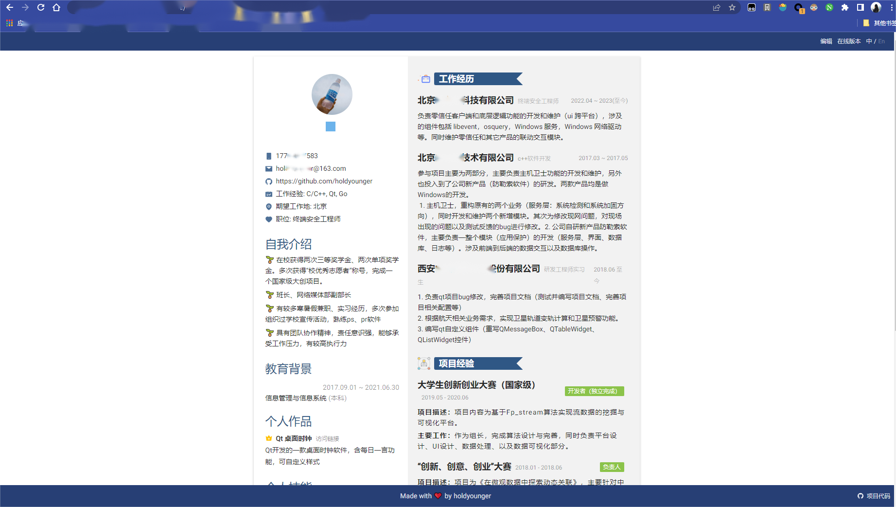
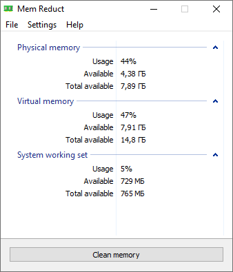
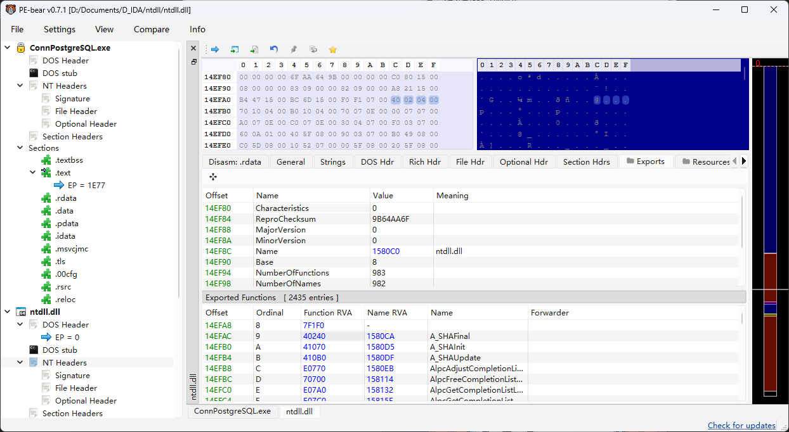

<h1 align="center">Welcome to 学习记录 👋</h1>

  

> 写在最前，本文是个人学习过程中整理的文档概要，涉及但不限于 `Qt|C++|Linux|Windows` 等方向。另外整理了看到的一些开源项目，供参考和学习。

## Author

👤 **mingming**

* Website: [holdyounger.github.io](holdyounger.github.io)
* Github: [@holdyounger](https://github.com/holdyounger)

本文转自 [🏠 Wiki](holdyounger.github.io),可直接访问 [🏠 Wiki](holdyounger.github.io)

[toc]

# 开源项目推荐

## [visiky/resume: 🚀 在线简历生成器](https://github.com/visiky/resume)

> :star: Starred 2k
>
> [visiky/resume: 🚀 在线简历生成器](https://github.com/visiky/resume)

1. 可通过json直接生成一份个人建立，方便维护的查阅。
2. 有多种模板可供选择，自定义主题色
3. 支持中英文版本
4. 可在线编辑

如下所示为我参考 [visiky](https://github.com/visiky)实现的个人简历。

## [henrypp/memreduct](https://github.com/henrypp/memreduct)

> :star: Starred 2.9k
>
> Lightweight real-time memory management application to monitor and clean system memory on your computer
>
> Windows 系统内存清理软件。其代码书写和设计以及功能实现很适合windows开发同学参考学习。

## Rust 开源学习教程 

[sunface/rust-course: “连续六年成为全世界最受喜爱的语言，无 GC 也无需手动内存管理、极高的性能和安全性、过程/OO/函数式编程、优秀的包管理、JS 未来基石" — 工作之余的第二语言来试试 Rust 吧。<<Rust语言圣经>>拥有全面且深入的讲解、生动贴切的示例、德芙般丝滑的内容，甚至还有JS程序员关注的 WASM 和 Deno 等专题。这可能是目前最用心的 Rust 中文学习教程 / Book](https://github.com/sunface/rust-course)

在这里你可以系统的学习 Rust 语法的特性。

## [SamyPesse/How-to-Make-a-Computer-Operating-System: How to Make a Computer Operating System in C++](https://github.com/SamyPesse/How-to-Make-a-Computer-Operating-System)

一个纯C代码写的教程。跟着教程一步一步来就足以覆盖你工作学习的全部内容了。

## StarList

1. [Windbg](https://github.com/stars/holdyounger/lists/windbg)：Windows Dbg 调试分享以及扩展插件的收录
2. [Windows](https://github.com/stars/holdyounger/lists/windows)：截止目前为止，分类中最多项目的 List。包括但不限于 Windows 工具、Hook、文章等等。
3. [POC](https://github.com/stars/holdyounger/lists/poc)：收集的漏洞相关 POC
4. [Windows Tools](https://github.com/stars/holdyounger/lists/windows-tools)：此工具非彼工具，除了一些 Windows 开发使用中可能会用到的工具，也有开发中需要用到的一些 开源静态库 项目，如 libssh2、libzip 等。

# 🐥社区推荐

Stack Overflow - Where Developers Learn, Share, & Build Careers
https://stackoverflow.com/

深信服社区
https://bbs.sangfor.com.cn/plugin.php?id=info:index#?orderby=dateline&type=index&page=1&init

Tide 安全团队
https://www.tidesec.com/

技术文章 - 先知社区
https://xz.aliyun.com/tab/1

安全脉搏 | 分享技术，悦享品质
https://www.secpulse.com/

Wikipedia, the free encyclopedia
https://en.wikipedia.org/wiki/Main_Page

知道创宇 Seebug 漏洞平台 - 洞悉漏洞，让你掌握前沿漏洞情报！
https://www.seebug.org/

Intezer - Autonomous Security Operations
https://intezer.com/

CodeMachine - Home
https://codemachine.com/index.html?__im-FarDSYvs=4356232983259770696

# 🚅 参赛经历

## 声网前端

1. [音频房间创建及连接说明](https://github.com/holdyounger/ScopeBlog/issues/126)
2. [声网参赛经历记录——白板插件开发(前端)](https://github.com/holdyounger/ScopeBlog/issues/139)

# 📚 书单

## 技术类

- 《计算机网络》
- 《深入理解Windows操作系统》
- 《C++Primer Plus》
- 《Effective C++》
- 《Windows 核心编程》

## 经济类

1. 《最懂输的人才能成为赢家：为什么正常的思维不会赢得交易》
2. 《货币战争》
3. 《大衰退：宏观经济学的圣杯》

## 其他

1. 《微习惯（1天1个俯卧撑、1天读1页书……每天只做一点点的无负担习惯策略，简单到不可能失败的自我管理法则！）》

# :star: 开源项目使用

1. [使用 osquery 查询系统uuid和系统信息 · Issue #175 · holdyounger/ScopeBlog](https://github.com/holdyounger/ScopeBlog/issues/175)
   跨平台系统信息查询软件，内置缓存数据库，适合用在频繁查询系统信息场景。
2. [Faran-17/Windows-Internals: Important notes and topics on my journey towards mastering Windows Internals](https://github.com/Faran-17/Windows-Internals)
   一个程序员的 Windows 学习笔记，个人认为其文章水平质量较高。对新手友好。

# :computer: Windows

## 工具推荐

### TokenUniverse

[diversenok/TokenUniverse: An advanced tool for working with access tokens and Windows security policy.](https://github.com/diversenok/TokenUniverse)

对于研究 Windows 安全机制非常有用。主要用于实验和研究 Windows 安全机智的高级工具。可以创建、查看、模拟和修改访问令牌、生成进程、管理 Local Security Authority、检查可用访问和修改许多类型对象的安全性。

### PE-Bear

[hasherezade/pe-bear: Portable Executable reversing tool with a friendly GUI](https://github.com/hasherezade/pe-bear)

一款使用体验极佳的 PE 查看工具，对 Windows 初学者非常友好。

***
_This README was generated with ❤️ by [readme-md-generator](https://github.com/kefranabg/readme-md-generator)_
